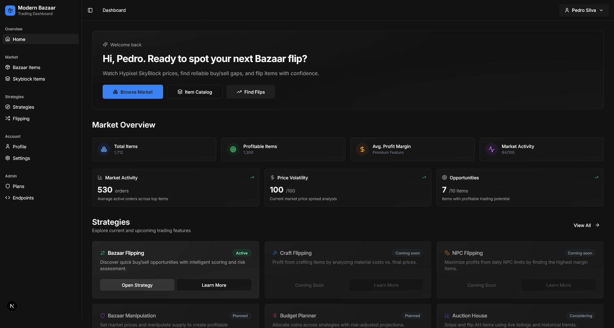
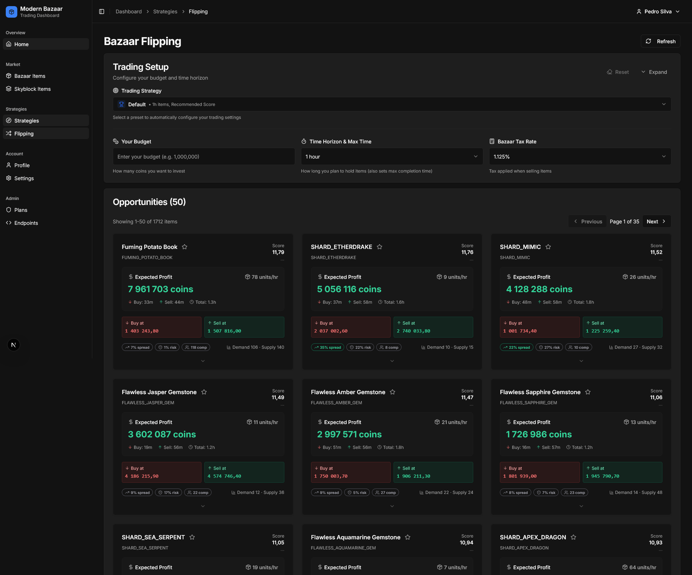
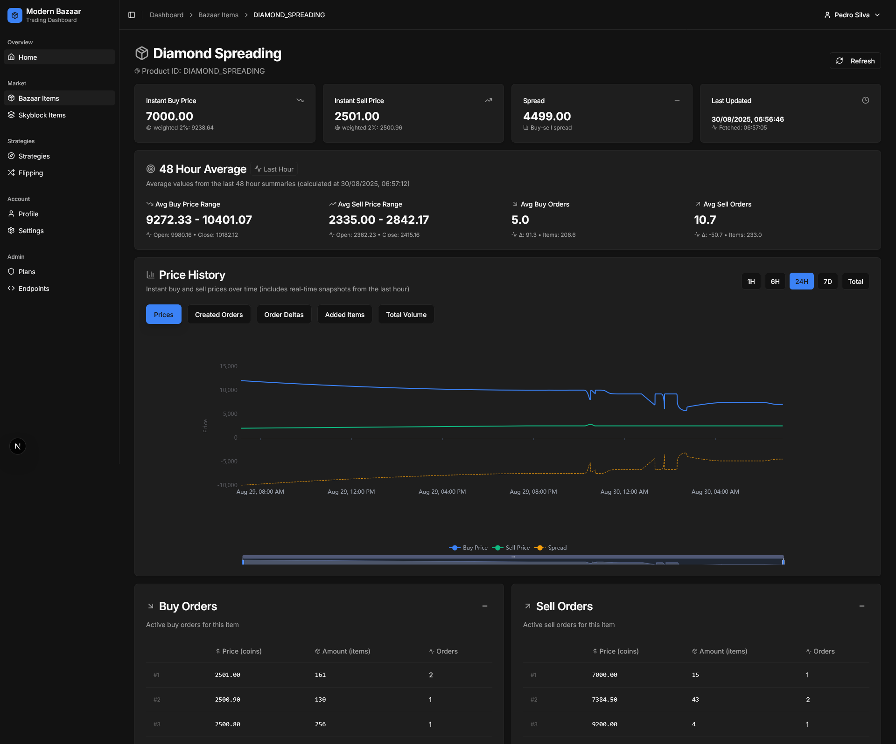

# Modern Bazaar

[](https://github.com/zF4ke/ModernBazaar/actions/workflows/ci.yml)
<!---->

> ⚠️ Work in progress.

A personal attempt to build a modular, enterprise‑grade bazaar market analyzer for Hypixel SkyBlock.
Java/Spring Boot core, TypeScript NextJS dashboard, Dockerized infra (PostgreSQL, Prometheus, Grafana).
Real-time bazaar analytics with comprehensive trading data and strategies; ML-driven forecasting and anomaly detection later.

## 📸 Preview

<div align="center">
  
  <br/>
  
  
</div>

*[View full-size screenshots](./SCREENSHOTS.md)*

## 💡 Vision 
A cleanly separated system:
- Core backend that fetches, monitors, stores, and serves market data via a stable API.
- Empirical data analysis for different trading strategies.
- Dashboard as the primary user interface.
- Optional Python/Java modules for heavier analysis or ML.
- Production-style observability and reliability

## 📐 Quantitative documentation

The complete mathematical and architectural specification is available as a
[compiled PDF](output/pdf/MODERN_BAZAAR_QUANTITATIVE_SYSTEM.pdf) and as
[LaTeX source](docs/MODERN_BAZAAR_QUANTITATIVE_SYSTEM.tex). It documents the data
pipeline, market metrics, risk model, flipping scorer, versioned manipulation
formulas, validation framework, and future simulation/ML direction.

## 🛣️ Roadmap
I'll try to keep this updated as I make progress, but it will not be exhaustive (especially around the specific trading strategies I want to implement).

- [x] Core project scaffolded (Gradle, Dockerfile, Spring profiles)
- [x] Infra stack (Postgres, Prometheus, Grafana) running with basic metrics
- [x] GitHub Actions CI/CD pipeline for building, testing, and deploying

**Core API & persistence**
- [x] Background job: poll Hypixel → `BazaarItemSnapshot`
- [x] Skip duplicate snapshots
- [x] Swagger UI & OpenAPI (`/swagger-ui.html`, `/v3/api-docs`)
- [x] **Hourly compaction**  
  • raw snapshots ➜ HourSummary + kept HourPoints  
  • deletes heavy snapshots once processed
- [x] `GET /api/bazaar/items` & `GET /api/bazaar/items/{productId}` (now live snapshot + HourSummary)
- [x] Pagination, filtering, error handling
- [x] Skyblock Items API + catalog refresh endpoints
- [x] `GET /api/bazaar/items/{productId}/history?from=&to=&withPoints=` (hour summaries)
- [x] `GET /api/bazaar/items/{productId}/average` (48-hour average calculations)
- [x] HTTP Basic authentication on API and actuator endpoints (Spring Security)
- [x] Service cache and rate limiting
- [x] Flyway baseline and initial migration
- [x] Optimize DB queries (30-60x performance improvement achieved)
- [x] Retention: Remove snapshots, summaries, and points older than 45 days
- [x] Finance metrics aggregation job: pre-computes rolling averages (1h/6h/48h) with startup bootstrap when table empty
- [ ] Optional S3 export for long-term history
- [ ] Cold-snapshot archive to reduce DB footprint
- [ ] (Optional) Trade journal tracking and storage
  
**Web Dashboard (Next.js + TypeScript)**
- [x] Basic dashboard structure with navigation
- [x] Bazaar Items page with pagination, filtering, composite live view
- [x] Skyblock Items page with filtering
- [x] Settings page with system status and data management
- [x] Multi-metric ECharts implementation (Price, Orders, Delta, Volume)
- [x] Interactive time-range controls (1H, 6H, 24H, 7D, Total)
- [x] Responsive layout, tooltips, zoom/pan, smooth animations
- [x] Advanced filtering and search features
- [x] 48-hour average card with frontend caching
- [x] Auth0 authentication (nextjs-auth0 v4, server sessions) with Discord, GitHub, and Google
- [x] Custom login page design
- [x] Subscriptions via **Lemon Squeezy (Merchant of Record)** — handles VAT/sales tax. Three tiers:
  - [x] Free plan ($0)
  - [x] Flipper plan — Bazaar Flipping finder
  - [x] Elite plan — adds Bazaar Manipulation
  - Stripe Managed Payments (Merchant of Record) live: checkout, webhooks, entitlements, refunds
- [x] Modern gradient-based UI design system
- [x] **Admin suite**: analytics, user management, discount codes, referrals, plans, endpoints
- [x] Profile page with user management

**Trading strategies, services and endpoints**
- [x] Bazaar Flipping
    - [x] Flipping Service and Flipping Scorer
    - [x] Risk Assessment
    - [x] Finance Averages
    - [x] `GET /api/strategies/flipping` endpoint
    - [x] Flipping route with budget input, sorting options, and pagination
    - [x] QoL features: flipping tutorial, favorite items, trading presets, etc.
    - [x] Caching and performance optimizations
- [ ] NPC Flipping
- [ ] Craft Flipping
- [x] Bazaar Manipulation
    - [x] Manipulation Service and Scorer (corner-cost, break-even-after-tax, inflated buy/sell orders, doublings, sell-through ETA)
    - [x] `GET /api/strategies/manipulation` endpoint with budget/ROI/tax/ratio filters
    - [x] Manipulation route with step-by-step plan cards
- [ ] Budget Planner
- [ ] Auction House

**Other**
- [ ] ML modules (prediction, anomaly detection) tied into Core
- [ ] Recording rules, alerts, refined Grafana dashboards
- [ ] Scale/shard where necessary

## ⚡ Quick start

```
git clone https://github.com/zF4ke/ModernBazaar.git
cd ModernBazaar
cp infra/.env.example infra/.env # fill in Postgres creds
./gradlew fullUp
```

Core health: http://localhost:8080/actuator/health  
Dashboard:   http://localhost:3000  
Prometheus:   http://localhost:9090  
Grafana:      http://localhost:3000

## 🔑 Becoming an admin

Admin pages (analytics, users, discounts, referrals) require the `manage:plans`
scope. The simplest way to grant yourself admin is the allowlist:

1. Sign in, open **/dashboard/profile**, and copy your user id (the Auth0 `sub`,
   e.g. `google-oauth2|123…`).
2. Put it in `infra/.env` as `ADMIN_USER_SUBS=google-oauth2|123…` (comma-separated
   for multiple), then restart core (`docker compose -f infra/docker-compose.yml -p modernbazaar up -d core`).
3. Sign out/in so a fresh token is issued. The Admin section appears in the sidebar.

The production-grade alternative is Auth0 RBAC: enable RBAC + "Add Permissions in
the Access Token" on the API, create a `manage:plans` permission and an Admin role,
and assign it to your user. The allowlist is meant for bootstrapping the first admin.

## 💸 Running costs

Auth0 and Lemon Squeezy both have costs that scale with usage. See
Cost/fee planning lives in a private spreadsheet (docs/private/, gitignored).

## License

CC BY‑NC‑SA 4.0
https://creativecommons.org/licenses/by-nc-sa/4.0/

This project is licensed under the Creative Commons Attribution-NonCommercial-ShareAlike 4.0 International License. 

---

This is a personal project and not affiliated with Hypixel. \
I'm not an expert at any of these technologies, so expect some rough edges, and I'm not used to contributions but if you want to help I'll try to be open to feedback and PRs. 💜
